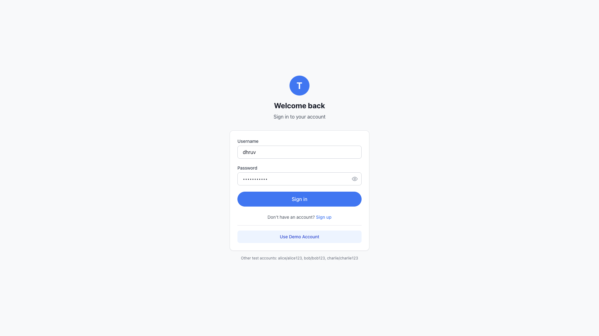
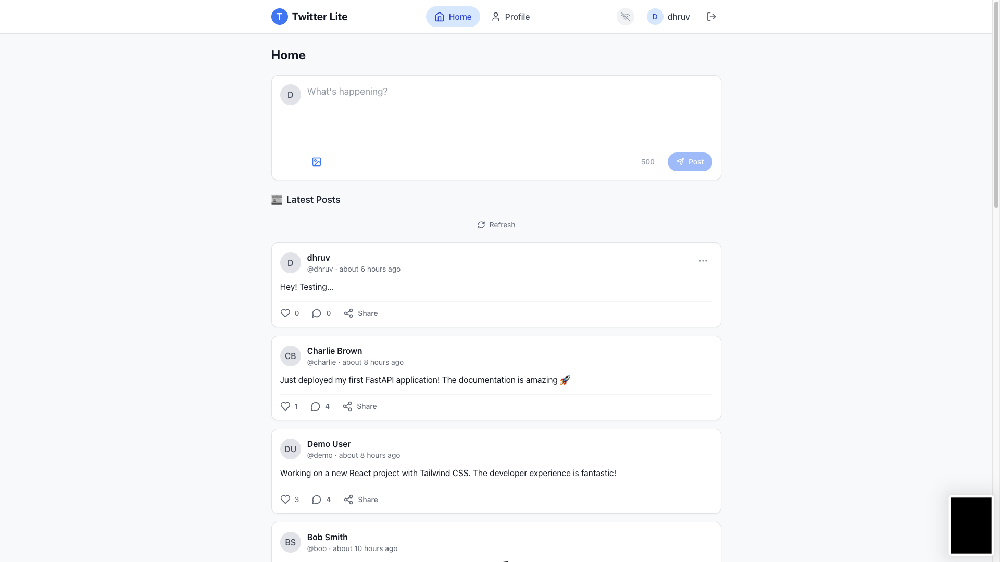
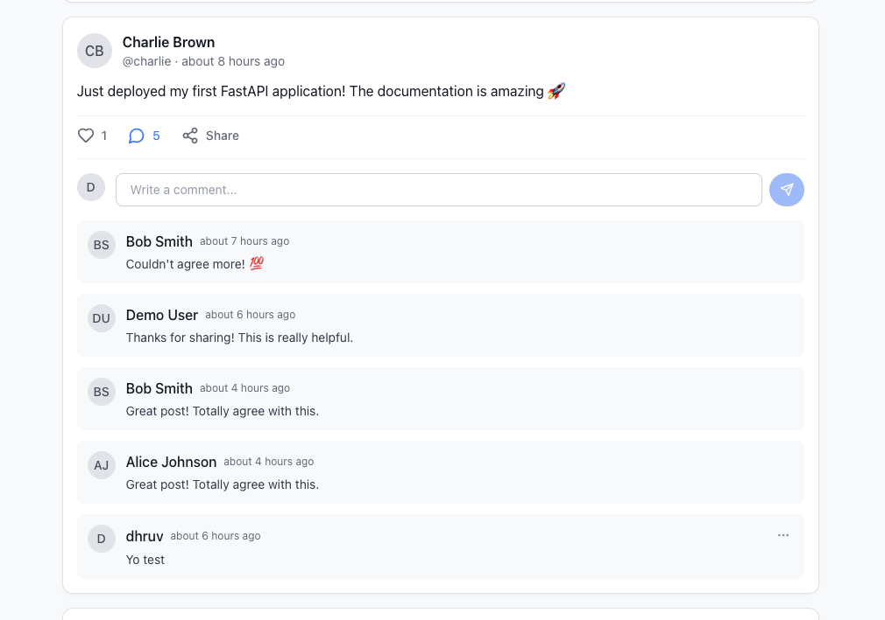
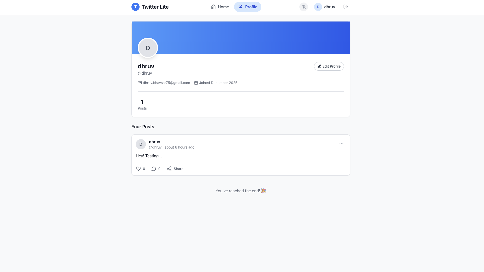

# Twitter Lite - Social Feed Application

A simple Twitter-like social feed application built with FastAPI (backend) and React (frontend), using PostgreSQL for data storage and Docker for containerization.

## 📸 Screenshots

<table>
  <tr>
    <td width="50%">
      
      <p align="center"><strong>Login Page</strong><br/>Clean authentication UI with registration option</p>
    </td>
    <td width="50%">
      
      <p align="center"><strong>Home Feed</strong><br/>Create posts and view the latest updates</p>
    </td>
  </tr>
  <tr>
    <td width="50%">
      
      <p align="center"><strong>Post Interactions</strong><br/>Like posts and add comments</p>
    </td>
    <td width="50%">
      
      <p align="center"><strong>Profile Page</strong><br/>View and edit user profile</p>
    </td>
  </tr>
</table>

## ✨ Features

### Frontend
- 📝 Post creation UI (text + optional image)
- 📰 Feed listing (newest first) with infinite scroll
- ❤️ Like/Comment functionality with animations
- 🔄 Real-time updates via WebSockets
- 📱 Responsive design with Tailwind CSS
- 🔐 JWT-based authentication

### Backend
- 🔑 JWT Authentication (register, login, profile management)
- 📮 RESTful API for posts, likes, and comments
- ⏱️ Rate limiting for posting (10 posts/min, 30 comments/min, 60 likes/min)
- 🖼️ Local image storage (no AWS required)
- 🔌 WebSocket support for real-time updates

### Database
- PostgreSQL with tables for:
  - `users` - User accounts
  - `posts` - User posts with optional images
  - `comments` - Comments on posts
  - `likes` - Post likes (unique per user per post)

## 🛠️ Tech Stack

| Layer | Technologies |
|-------|-------------|
| **Frontend** | React 18, React Router, Tailwind CSS, Axios, Vite |
| **Backend** | FastAPI, SQLAlchemy, Pydantic, python-jose (JWT) |
| **Database** | PostgreSQL 15 |
| **Containerization** | Docker & Docker Compose |

## 📋 Prerequisites

- Docker and Docker Compose installed
- Git (to clone the repository)

## 🚀 Quick Start

### 1. Clone and navigate to the project

```bash
cd ey-assignment
```

### 2. Start the Application

```bash
# Build and start all services
docker-compose up --build

# Or run in detached mode
docker-compose up --build -d
```

### 3. Access the Application

| Service | URL |
|---------|-----|
| **Frontend** | http://localhost:3000 |
| **Backend API** | http://localhost:8000 |
| **API Documentation** | http://localhost:8000/api/docs |
| **ReDoc** | http://localhost:8000/api/redoc |

### 4. Login with Demo Account

The application automatically seeds demo data on first startup.

| Username | Password | Description |
|----------|----------|-------------|
| **demo** | **demo123** | Primary demo account |
| alice | alice123 | Test user |
| bob | bob123 | Test user |
| charlie | charlie123 | Test user |

1. Go to http://localhost:3000
2. Click "Use Demo Account" button, or enter credentials manually
3. Start exploring the feed!

> **Note:** You can also register a new account if you prefer.

## 📁 Project Structure

```
ey-assignment/
├── backend/
│   ├── app/
│   │   ├── main.py              # FastAPI entry point
│   │   ├── config.py            # Configuration settings
│   │   ├── database.py          # Database connection
│   │   ├── models/              # SQLAlchemy models
│   │   ├── schemas/             # Pydantic schemas
│   │   ├── routers/             # API endpoints
│   │   │   ├── auth.py          # Authentication
│   │   │   ├── posts.py         # Posts CRUD
│   │   │   ├── comments.py      # Comments CRUD
│   │   │   ├── likes.py         # Like/Unlike
│   │   │   └── websocket.py     # Real-time updates
│   │   └── services/            # Business logic
│   ├── requirements.txt
│   └── Dockerfile
│
├── frontend/
│   ├── src/
│   │   ├── components/          # React components
│   │   ├── pages/               # Page components
│   │   ├── context/             # React context (Auth, WebSocket)
│   │   ├── services/            # API client
│   │   └── hooks/               # Custom hooks
│   ├── package.json
│   ├── vite.config.js
│   └── Dockerfile
│
├── docs/screenshots/            # Application screenshots
├── docker-compose.yml
└── README.md
```

## 📡 API Endpoints

### Authentication
| Method | Endpoint | Description |
|--------|----------|-------------|
| POST | `/api/auth/register` | Register a new user |
| POST | `/api/auth/login` | Login and get JWT token |
| GET | `/api/auth/me` | Get current user profile |
| PUT | `/api/auth/me` | Update profile |

### Posts
| Method | Endpoint | Description |
|--------|----------|-------------|
| GET | `/api/posts` | Get paginated feed |
| GET | `/api/posts/{id}` | Get single post |
| POST | `/api/posts` | Create post (with optional image) |
| PUT | `/api/posts/{id}` | Update post |
| DELETE | `/api/posts/{id}` | Delete post |
| GET | `/api/posts/user/{id}` | Get user's posts |

### Comments
| Method | Endpoint | Description |
|--------|----------|-------------|
| GET | `/api/comments/post/{id}` | Get post comments |
| POST | `/api/comments/{post_id}` | Add comment |
| DELETE | `/api/comments/{id}` | Delete comment |

### Likes
| Method | Endpoint | Description |
|--------|----------|-------------|
| POST | `/api/likes/{post_id}` | Like a post |
| DELETE | `/api/likes/{post_id}` | Unlike a post |
| POST | `/api/likes/{post_id}/toggle` | Toggle like |

### WebSocket
| Endpoint | Description |
|----------|-------------|
| `WS /ws/feed` | Real-time feed updates |


## 🐳 Docker Commands

```bash
# Start all services
docker-compose up --build

# Start in detached mode
docker-compose up -d

# View logs
docker-compose logs -f

# Stop all services
docker-compose down

# Stop and clear database
docker-compose down -v
```

## ⚡ Rate Limiting

| Action | Limit |
|--------|-------|
| Create Post | 10 per minute |
| Create Comment | 30 per minute |
| Like/Unlike | 60 per minute |

## 🔒 Environment Variables

Key environment variables (with defaults):

| Variable | Default | Description |
|----------|---------|-------------|
| `DATABASE_URL` | `postgresql://postgres:postgres@db:5432/twitter_lite` | Database connection |
| `SECRET_KEY` | `your-super-secret-key...` | JWT signing key |
| `ACCESS_TOKEN_EXPIRE_MINUTES` | `30` | Token expiration |
| `MAX_FILE_SIZE` | `5242880` | Max upload size (5MB) |

## 🚨 Troubleshooting

### Database connection issues
```bash
# Check if database is running
docker-compose ps

# View database logs
docker-compose logs db

# Restart services
docker-compose restart
```

### Frontend not loading
```bash
# Check frontend logs
docker-compose logs frontend

# Rebuild frontend
docker-compose build frontend
docker-compose up frontend
```

### Clear everything and start fresh
```bash
docker-compose down -v
docker system prune -f
docker-compose up --build
```

## 📝 Production Considerations

For production deployment:

1. **Change SECRET_KEY** - Use a strong, unique secret
2. **Enable HTTPS** - Configure SSL/TLS
3. **Update CORS** - Restrict allowed origins
4. **Use managed database** - Consider AWS RDS, etc.
5. **Add monitoring** - Prometheus, Grafana
6. **Set up logging** - ELK stack or similar
7. **Configure backups** - Regular database backups

## 📄 License

MIT License